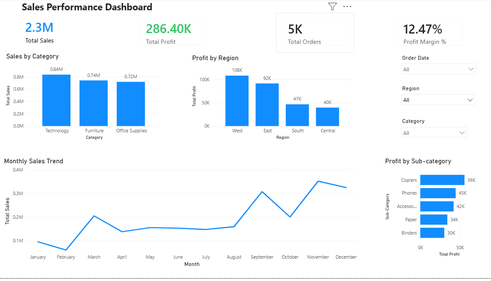

# Sales Analytics Dashboard

## Overview
This project analyzes sales performance using Power BI and provides insights into sales, profit, orders, categories, regions, and monthly trends. The dashboard helps identify key business drivers and supports data-driven decision-making.

## Dataset
- Superstore Sales Dataset

## Tools Used
- Power BI
- Power Query
- DAX
  
## Dashboard Preview

## KPIs
- Total Sales: 2.3M
- Total Profit: 286.40K
- Total Orders: 5K
- Profit Margin: 12.47%

## Analysis Performed
- Category-wise Sales Analysis
- Region-wise Profit Analysis
- Monthly Sales Trend Analysis
- Sub-Category Performance Analysis

## Key Insights
- Technology generated the highest sales.
- West region generated the highest profit.
- Copiers was the most profitable sub-category.
- November recorded the highest sales activity.
- Overall profit margin was 12.47%.

## Skills Demonstrated
- Data Cleaning using Power Query
- DAX Measure Creation
- KPI Development
- Dashboard Design
- Data Visualization
- Business Insight Generation

## Project Files
- Sales Analytics Dashboard.pbix
- dashboard.png
- README.md
